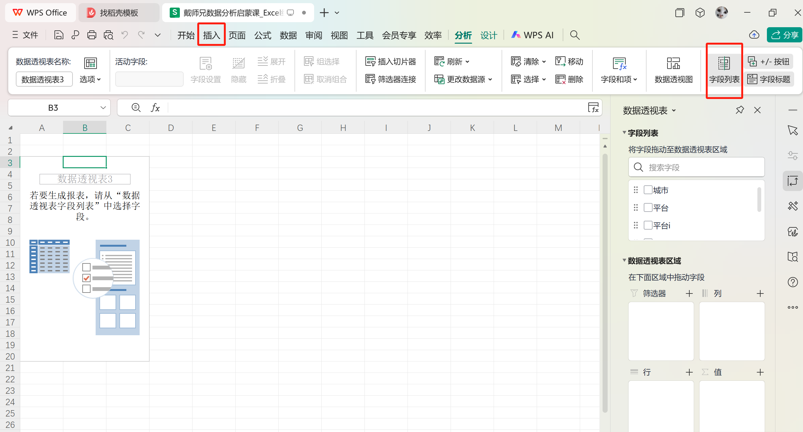
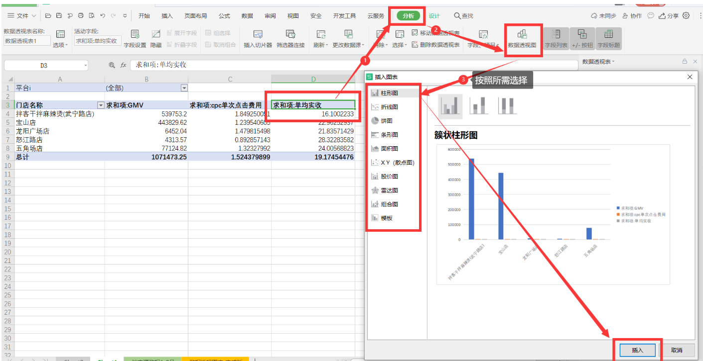
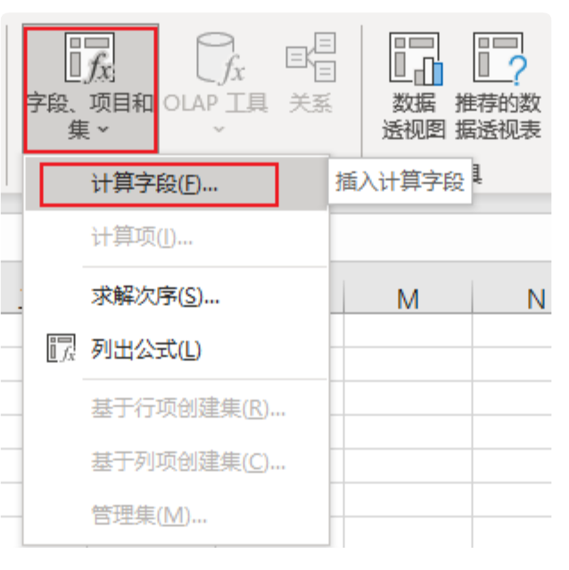
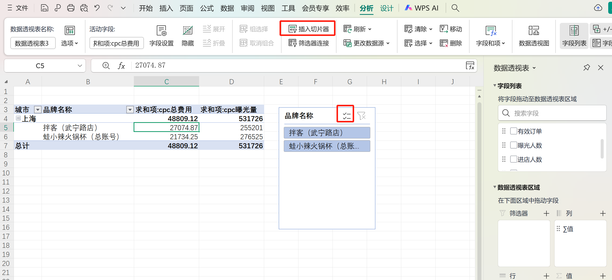

# 一、基础概念-表头

## GMV
- **定义**：GMV是Gross Merchandise Volume的缩写，中文为商品交易总额或成交总额。它是指一定时间内的成交总额，包括付款和未付款的订单金额。
- **计算公式**：GMV = 销售额 + 未支付订单金额 + 拒收订单金额 + 退货订单金额。
- **用途**：GMV用于衡量电商平台的实力和发展潜力，可以反映顾客的购买意向。

## 商家实收
- **定义**：指商家实际收到的款项，通常不包括退货或取消订单的金额。
- **计算方法**：实收金额 = 销售额 - 退货金额 - 取消订单金额。
- **单均实收**：商家实收/有效订单

## 门店曝光量
- **定义**：指门店被潜在客户看到的次数或机会，相当于在线广告中的PV（Page View）。
- **用途**：用于衡量门店的知名度和吸引力。

## 门店访问量
- **定义**：指实际进入门店的人数，相当于UV（Unique Visitor）。
- **用途**：用于衡量门店的吸引力和实际客流。

## 门店下单量
- **定义**：指在门店下单的客户数量。
- **用途**：用于衡量门店的销售效率。

## 曝光人数
- **定义**：指看到门店或广告的人数，相当于PV的概念。
- **用途**：用于衡量广告或门店的覆盖范围。

## 进店人数
- **定义**：指实际进入门店的人数，相当于UV的概念。
- **用途**：用于衡量门店的实际客流。

## 访问人数
- **定义**：指访问门店或网站的人数，相当于UV的概念。
- **用途**：用于衡量门店或网站的吸引力。

## CPC
- **定义**：CPC是Cost Per Click的缩写，指每次点击广告的成本。
- **用途**：用于衡量广告的点击效率和成本。
- **cpc单次点击费用**：cpc总费用/cpc访问量
## 环比
- **定义**：指与上一个相同时间周期的数据进行比较，用于衡量短期的增长或下降。
- **用途**：用于快速评估短期的业务表现。

## 同比
- **定义**：指与去年同期的数据进行比较，用于衡量长期的增长或下降。
- **用途**：用于评估长期的业务趋势和发展情况。

## UV
unique visitor
## PV
page view

# 二、EXCEL 操作技巧 #
## 日期引用

### 1. Date, Year, Month
- **DATE函数**：用于生成特定日期，其语法为`DATE(year, month, day)`。
- **YEAR函数**：返回日期的年份。
- **MONTH函数**：返回日期的月份。

### 2. 求每个月的最后一天
- **方法1**：使用公式`DATE(YEAR(日期), MONTH(日期), 1)`，然后通过循环或公式计算每个月的天数。
- **方法2**：使用公式`DATE(YEAR(日期), MONTH(日期) + 1, 1) - 1`，直接计算每个月的最后一天。

## 格式转化

1. **存储日期**：建议将日期存储为字符串形式，而不是使用Excel的日期格式。这可以避免格式转换问题。
2. **字符串比较**：在比较字符串时，可以使用`>=`运算符，例如`'>='&`，以确保正确比较。

## 冻结行或列

- **快捷键**：使用`Fn + F4`（或`Alt + W + F`）来冻结窗口中的行或列。

## 通配符

- **使用方法**：在查找或公式中使用通配符，如`&'*'`，可以匹配所有以查找项开头的项目。
- **常用通配符**：
  - `*`：匹配任意数量的字符。
  - `?`：匹配单个字符。

## 占位符

- **使用方法**：使用多个`?`作为占位符，可以表示字符串的长度。例如，`??`表示两个字符的长度。

## 绝对引用和相对引用

在Excel中，单元格引用有两种主要类型：**相对引用**和**绝对引用**。此外，还有**混合引用**，它结合了相对和绝对引用的特点。

### 1. 相对引用

- **定义**：相对引用是Excel的默认引用方式。当你复制公式到其他单元格时，行号和列号会根据实际的单元格位置发生变化。
- **示例**：`=SUM(A1:B1)`，如果你将这个公式复制到下一行，公式会变成`=SUM(A2:B2)`。
- **用途**：适合于需要根据单元格位置动态调整引用的情况。

### 2. 绝对引用

- **定义**：绝对引用通过在行号和列标前添加美元符号 `$` 来表示。它在复制公式时保持引用的单元格地址不变。
- **示例**：`=SUM($A$1:$B$1)`，无论将这个公式复制到哪里，始终引用A1到B1的范围。
- **用途**：适合于需要固定某个单元格或范围作为基准点的情况。

### 3. 混合引用

- **定义**：混合引用是指行或列中只有一个是绝对引用，另一个是相对引用。通过在行号或列标前添加 `$` 来实现。
- **示例**：
  - `$A1`：列绝对，行相对。
  - `A$1`：行绝对，列相对。
- **用途**：适合于需要在某一维度保持固定，而另一维度随着复制而变化的情况。

### 切换引用类型
通过按下`F4`键来快速在相对引用、绝对引用和混合引用之间切换。每次按下`F4`，引用类型会依次切换。

---------

# 三、数据透视表和图
1. 数据透视表
选中源数据，点击插入，数据透视表，确定，新建一张新的数据透视表

- 如图所示，先插入，然后选择字段列表，展开右侧的具体内容
- 拖拽字段进行计算和重命名：（1）将文本字段拖到行、数值型字段拖到值，透视表就会自动进行云运算
（2）双击字段名称，进行重命名，并且选择计算的类型，excel默认的计算方式是求和
2. 数据透视图
- 概念理解：这个是针对数据透视表中的某个字段的数据图显示
- 这个数据透视图，既可以针对一个数值进行制作，也可以根据多个数值制作组合图

3. 创建新的字段

- 选中数据透视表，点击数据透视表分析选项卡，进入功能区，在计算部分中找到字段、项目和集，点击插入计算字段
4. 插入切片器

- 在数据透视表分析功能区，在筛选部分找到插入切片器，选择字段作为切片器
- 点击切片器的选项，数据就会自动地根据切片器的选项进行计算
- 除了切片器筛选，还可以直接将字段拖拽到筛选
- 注意:筛选只能在透视表内使用，而切片器可以复制到任意工作表使用

# 三、Excel函数

## SUM函数
- **定义**：用于计算一系列数字的总和。
- **语法**：`SUM(number1, [number2], ...)`
- **示例**：`=SUM(A1:A10)`，计算A1到A10单元格的总和。

## SUMIF函数
- **定义**：根据条件计算一系列数字的总和。
- **语法**：`SUMIF(range, criteria, [sum_range])`
  - **range**：要应用条件的范围。
  - **criteria**：要应用的条件。
  - **[sum_range]**：可选，指定要计算总和的范围。
- **示例**：`=SUMIF(A1:A10, "Apple", B1:B10)`，计算A列中值为"Apple"对应的B列总和。

## SUMIFS函数
- **定义**：根据多个条件计算一系列数字的总和。
- **语法**：`SUMIFS(sum_range, criteria_range1, criteria1, [criteria_range2], [criteria2], ...)`
  - **sum_range**：要计算总和的范围。
  - **criteria_range1**：第一个要应用条件的范围。
  - **criteria1**：第一个要应用的条件。
  - **[criteria_range2]**、**[criteria2]**：可选，第二个要应用条件的范围和条件。
- **示例**：`=SUMIFS(C1:C10, A1:A10, "Apple", B1:B10, "Large")`，计算A列为"Apple"且B列为"Large"的C列总和。

## SUBTOTAL函数
- **定义**：用于计算一系列数字的总和，但可以忽略隐藏的行。
- **语法**：`SUBTOTAL(function_num, ref1, [ref2], ...)`
  - **function_num**：要执行的函数编号（1为SUM）。
  - **ref1**：要计算总和的范围。
- **示例**：`=SUBTOTAL(1, A1:A10)`，计算A1到A10单元格的总和，忽略隐藏行。
  
### 和SUM的区别
- **SUM**函数会计算所有指定范围内的值，无论行是否隐藏。
- **SUBTOTAL**函数可以忽略隐藏的行，这在使用筛选或分组时尤其有用。

## IF嵌套
- **定义**：在一个IF函数中嵌套另一个IF函数，以实现多层条件判断。
- **语法**：`=IF(条件1, 值1, IF(条件2, 值2, 值3))`
- **示例**：`=IF(A1>10, "大于10", IF(A1=10, "等于10", "小于10"))`，判断A1的值是否大于、等于或小于10，并返回相应的字符串。

---

## VLOOKUP函数

### 1. Look Up Value
- **通配符匹配**：可以使用通配符（如`*`或`?`）来实现模糊匹配，但只能返回第一个匹配的值。
- **精确匹配**：使用`0`作为匹配类型，要求查找值必须完全匹配。
- **近似匹配**：使用`1`或`-1`作为匹配类型，分别查找小于或等于、或大于或等于的值。

### 示例
- **精确匹配**：`=VLOOKUP("Apple", A1:B10, 2, 0)`
- **通配符匹配**：`=VLOOKUP("*Apple*", A1:B10, 2, 0)`，查找以"Apple"结尾的值

## INDEX函数和MATCH函数

### 1. INDEX函数
- **语法**：`INDEX(range, row_num, [col_num])`
  - **range**：指定要搜索的范围。
  - **row_num**：指定要返回的行号。
  - **[col_num]**：可选，指定要返回的列号。
- **示例**：
  - `=INDEX(A1:A10, 3)`，返回A1:A10范围中的第三个值。
  - `=INDEX(A1:C10, 3, 2)`，返回A1:C10范围中的第三行第二列的值。

### 2. MATCH函数
- **语法**：`MATCH(lookup_value, lookup_array, [match_type])`
  - **lookup_value**：要搜索的值。
  - **lookup_array**：搜索范围。
  - **[match_type]**：可选，指定匹配类型（0为精确匹配，1为小于或等于，-1为大于或等于）。
- **示例**：`=MATCH("Apple", A1:A10, 0)`，返回"Apple"在A1:A10范围中的位置。

### 3. INDEX函数和MATCH函数进行嵌套
- **语法**：`=INDEX(B1:B10, MATCH("John", A1:A10, 0))`
- **与VLOOKUP的不同点**：
  - **VLOOKUP**需要指定一个固定列索引，而`INDEX/MATCH`可以动态查找任意列。
  - **VLOOKUP**如果表格结构变化（如插入或删除列），可能会导致错误，而`INDEX/MATCH`可以适应这些变化。

---

# 四、大厂周报制作 #
## 环比、同比 ##
## 结果指标 ##
## 过程指标 ##