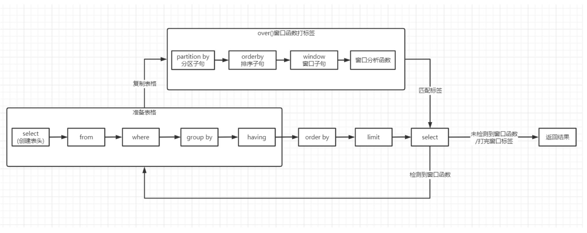
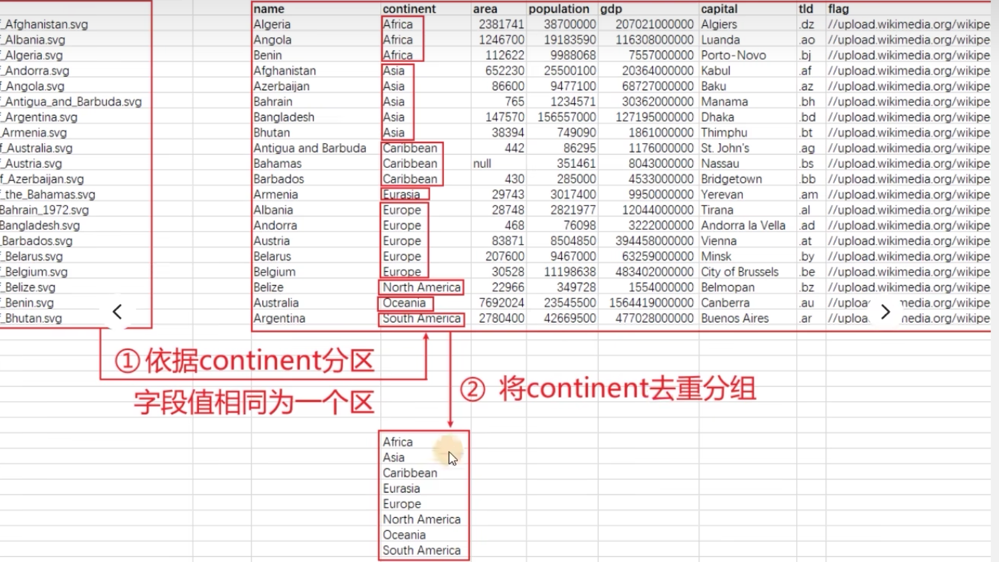

# 一、基础语法
## TIPS
* 行与行之间需要使用分号，其它时候不需要
* 一种用法与另外一种用法需要用回车隔开
'select //
 from //
 order by //
 limit'
* 语法结构：select-from-where-group by-having-order by-limit
* 运行顺序：from-where-group by-having-order by -limit -select
注释：

1. 整体逻辑可以看作是excel表，在写函数的时候，按照excel表的思路去捋顺就可以
比如：我需要处理数据，拿到一堆excel，我首先需要确定处理的是哪个表格，就是from
然后，我需要对原表进行筛选，使用where
group by 类似于数据可视表，但是这点我不太会，那么就可以理解为bundle，就是一捆，用by后边的字段，作为标准，进行捆绑
捆绑之后，需要呈现捆绑数量，则使用having
需要排序，使用order
在所有的数据处理完毕之后，需要使用limit进行约束，显示表格的数量
select则是最后选择在上述所有内容处理完毕之后，选择想要展示的具体**'列'**
2. 从上述的解释来看，where到limit都是对excel的行进行约束，而select则是对列进行约束

---

## （一）展示 select
1. 单列、多列
select 字段，字段 from <表名>
* 注：中间都有空格，字段与字段之间有英文逗号
2. 所有列
select * from <表名>
3. 别名
select 字段 as 别名 （as可以省略）
4. 去重
select distinct 字段 from <表名>
* distinct必须跟在select后，即只能给多个列同时去重，不能只针对某一列进行单列去重
5. 运算
select 字段1，字段2/字段3 别名， from <表名>
* **' 字段2/字段3 别名 '** 这一段是进行了重命名+运算
---

## （二）筛选 where
* 定义：看作是excel中的筛选功能
* 由于是筛选，所以需要筛选的条件输入语法，会牵扯到一定的运算符
* 运算符查询语法：select 字段 from 表 where 字段 运算符 数值
### 1. 精确查询 
_**- 基础运算符**_
*  （1）特殊的：between and（这个包括边界值）
*  （2）布尔运算

is 

or

and

not

注释：

and运算优先级大于or，实在分不清的话用()隔开

**_- 筛选条件类型_**
* 数值：直接连接运算符
* 字符串：需要配合''英文单引号
* null（空值）
### 2. 模糊查询
* select 字段 from 表 where 字段 like '通配符+字符'
* 占位符：_
* 通配符：%

## 三、降序升序
* order by 
* 降序：select 字段 from 表 [where表达式]  [order by 字段 asc升序/desc降序]
* 后可以加多个字段，按照字段的顺序进行 ***顺序*** 筛选
* order by subject in ('字段1'，'字段2'),意思为这两个字段记作1，其它字段看作0，结果是这两个字段的行被排在整体表格的最后

## 四、行数限制
* [order by 表达式]  //limit 3  意思为满足这个排序的前三行数据
* 位置偏移 
**limit x，n**，n是偏移的量
例如：limit 3，4；意在第4-7行的数据
# 五、聚合计算 group by
## （一）聚合函数
* count()
* avg()
* sum()
* max()
* min()
## （二）概念
* 分区
* 分组：合并同样的内容

# 六、聚合后筛选-having
## （一）概念
1. 聚合后筛选，一般跟在group by后边
2. 聚合前筛选，一般使用where

例题：
查询总人口数至少为3亿的大洲和其平均gdp，
其中只有gdp高于200亿且人口数大于6000万
或者gdp低于80亿且首都中含有三个a的国家计入计算，
最后按国家数从大到小排序，
只显示第一行

答案：
select
continent
,avg(gdp) 平均gdp
from world
where gdp > 20000000000
and population > 60000000
or (gdp < 8000000000
and capital like '%a%a%a%')
group by continent
having sum(population) >= 300000000
order by count(name)desc
limit 1

# 七、常见函数
## （一）数学函数
round（x，y），对数值x进行四舍五入，保留y个小数位
## （二）字符串函数
1. concat（'s1','s2'）连接字符串，返回s1s2
2. replace（'s','s1','s2'）指的是，对s字符串进行处理，使用s2代替所有的s1
3. left（s，n）、right（s，n）意思是，对s字符串的左边n个字符进行截取；right同理
4. substring（s，n，len）对字符串s的第n个，长度为len的字符进行截取
## （三）数据类型转换函数
cast（x as type），把x类型转换为type类型
## （四）日期函数
1. 基础函数
year（date）、month（date）、day（date）
2. 日期增减：
date_add(date,interval x year/month/hour/.../second)
date_sub(date,interval x year/month/h/min/s)
3. 计算两个日期之间间隔的天数
datediff('date'','date2')两个日期之间的天数
4. 日期格式化
date_formaat(date,format)将日期格式化
## （五）条件判断函数
1. if(expr,v1,v2)如果expr这个表达式为真，返回v1，否则v2
2. case when
* 这个相当于excel中的ifs
* case when v1 then r1 when v2 then r2
* 每一组的when..then是一个条件表达，即当v1成立，则结果返回r1；即当v2成立，则结果返回r2....

# 二、高级语句
## （一）窗口函数
### 1. 定义
类似于在处理完having之后复制了此时的表格，为一个新的窗口表格；
此时有两个表格，
最后select在呈现的时候，既可以呈现第一个表格，也可以呈现第二个窗口表格中计算的内容
* 注意事项：
窗口函数需要放在select后
### 2. 排序窗口基本语法
function_name() OVER (

  [PARTITION BY column_list]

  [ORDER BY column_list]

  [frame_clause]
)

function_name: 窗口函数的名称，如ROW_NUMBER()、RANK()、DENSE_RANK()等。

PARTITION BY: 可选，定义行分组的方式，类似于GROUP BY。

ORDER BY: 可选，定义分区内行的排序方式。

frame_clause: 可选，定义当前分区内的行子集（窗口帧），支持ROWS或RANGE模式。

* rank():跳跃排序,类似于高考排名
* dense_rank()：连续排序，例如排序结果为1，1，2，3
* row_number：就是全排，1，2，3，4
###  3. 偏移窗口函数
* LAG()函数
功能：访问当前行之前的指定偏移量的行数据。
语法：LAG(expression, offset, default) OVER (order_clause)

expression: 要获取的列或表达式。

offset: 偏移量，表示要获取的行相对于当前行的位置。默认为1，表示获取当前行之前的一行。

default: 可选参数，当没有足够的行来满足偏移量时返回的默认值。（一般不用）

order_clause: 可选参数，用于指定结果集的排序顺序。

* LEAD()函数
功能：访问当前行之后的指定偏移量的行数据。

语法：LEAD(expression, offset, default) OVER (order_clause)

参数与LAG()相同，但方向相反。
## （二）表连接
### 1.内连接
### 2.左连接
### 3.右连接
## （三）子查询