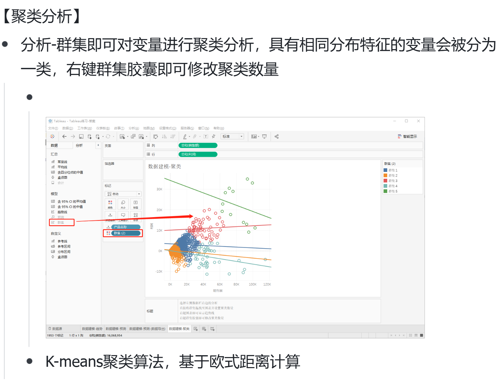
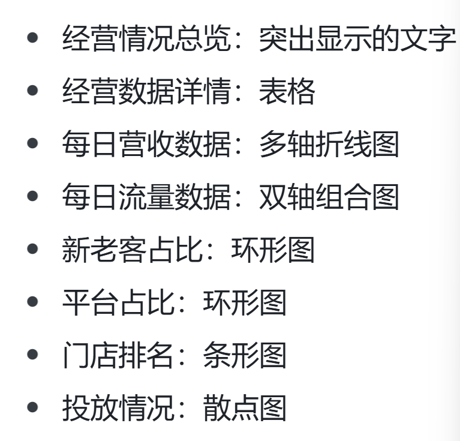

# 一、BI概念
BI（Business Intelligence）是指通过数据分析和可视化来支持商业决策的过程。它涉及收集、存储和分析数据，以提供对业务的洞察。
# 二、tableau大致介绍
## TIPS
* 列是横轴，行是纵轴
* 离散和连续
* 群集预测
* 双轴和同步轴
* 只会用智能展示不算掌握tableau
* 工具提示
## （一）分类
数据可视化整体可以分为四类
* 艺术流：视觉设计
* 分析流：有一个特定的主题
* 实战流：工作使用，这注定页面朴实无华，没有太多的美化
## （二）作用
* 数据赋能：业务一线轻松使用
* 数据探索：通过统计分析和数据可视化，从数据发现问题 ，用数据验证假设
## （三）横向对比
* excel 难以处理大量数据
* sql作图有问题
* python/r 需要大量的时间进行基础学习
---
# 三、数据连接
## （一）连接类型
### 1. 本地文件
* csv数据连接到文本
* xls/xlsx连接到excel
* json连接到json 
### 2.数据库
下载数据库参数，填写地址等参数
## （二）连接方式
* 默认使用智能连接
*  先连接到shop，然后推拽cpc，选择连接字段
* 继续拖拽orders，先与shop连接，选择连接字段
## （三）提取方式
### 1、实时
### 2、数据提取（实用）
* hype格式的数据提取
* 保存为twbx格式，
* 缺点是每次修改完数据源就要重新提取一遍数据
* 数据量超百万，需要使用增量刷新
## （四）连接筛选
可以使用筛选器来限制连接的数据范围
## （五）保存类型
* twb：不包含数据
* twbx：内置数据到tableau的文件中，可以看作是缓存
## （六）数据处理
* 可以查看数据，进行排序、重命名、拆分等
* 这些操作在作图界面也可以完成
# 四、数据可视化原理、原则
## （一）数据类型
* 维度：负责区分
* 度量：映射图形
## （二）可拖拽领域
* 行列
* 标记卡
* 筛选器
## （三）数据可视化原则
* 区分用户
* 主次分明、详略得当（位置、颜色、大小、形状，重要性依次递减的顺序）
* 真实准确
* 符合大众认知
* 适度原则（颜色不能超过八种，避免使用3d效果）
* 5秒原则（作图的目的是为了让别人五秒内看懂）
* 恰到好处的说明：标题、图例、标准、结论【右键数据添加注释】
# 五、基础图表制作
# 六、图形类型及BI仪表盘搭建

## （一）图表类型
### 1.对比分析：比大小
* 柱状图（使用场景、图标逻辑、制作流程）
* 条形图（使用场景、图标逻辑、制作流程）
* 热力图
* 气泡图
* 词云
### 2.变化分析：看趋势
* 折线图（没有累计关系）
* 面积图（有累计关系）
### 3.构成分析：看占比
* 饼图
* 树地图（对象大于三个）
* 堆积图
### 4.关系分布：看位置
* 散点图（多变量分布）
* 气泡图（多变量分布）
* 直方图（单变量分布）
* 地图

## （二）数据排序
1. 原则
营收＞投放＞流量
2. 关键数据分类
* 营收数据
* 流量数据
3. 图表选择

## （三）bi仪表盘搭建
